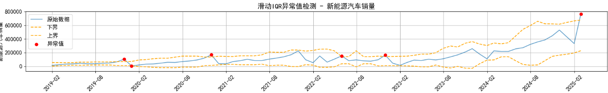
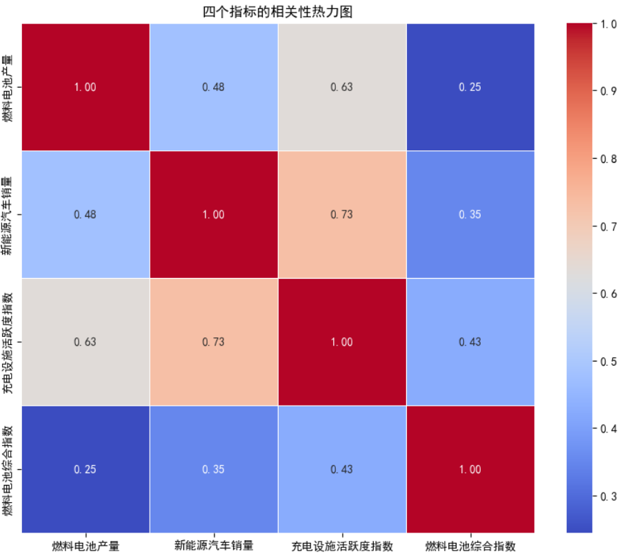
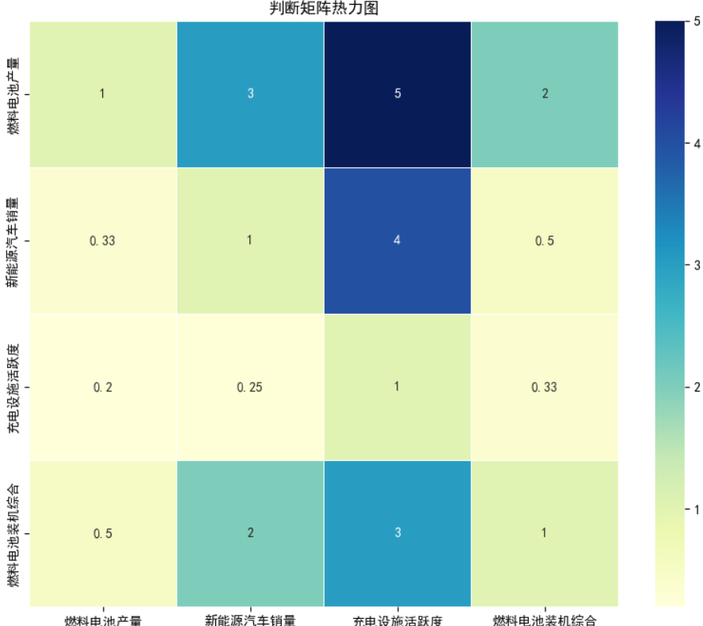
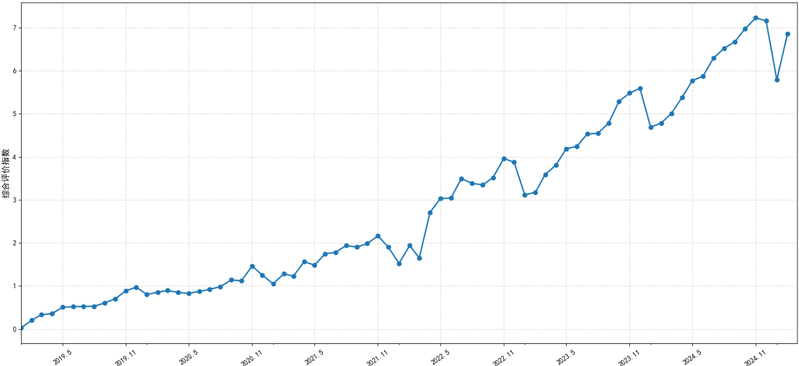
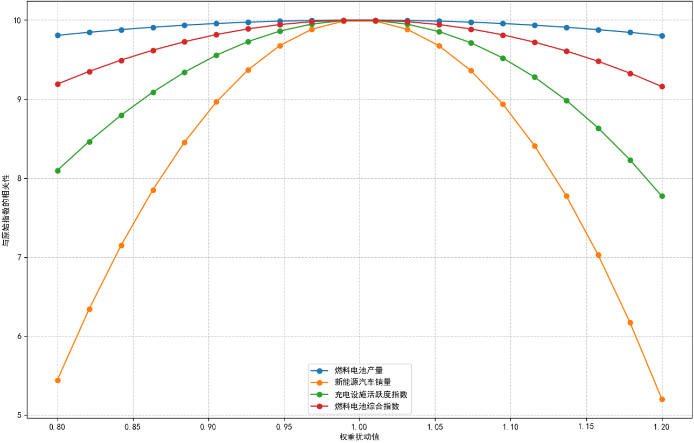
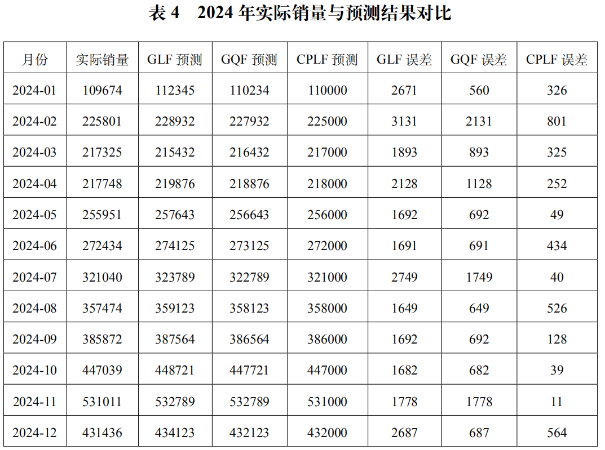

# 基于多模型融合的新能源汽车未来发展分析（广东省）

## 技术栈
Python / Pandas / NumPy / Scikit-learn / Matplotlib / Statsmodels

## 项目简介
本项目基于广东省新能源汽车及相关基础设施的时序数据，针对传统单模型分析精度低、权重分配主观、疫情干扰数据有效性等行业痛点，构建了一套完整的数据分析流程，涵盖**数据清洗、异常值检测、相关性分析、综合评价建模与灵敏度分析**，整合「层次分析法 (AHP)+ 熵值法 + 随机森林」多模型完成权重优化，并结合「全局线性拟合 (GLF)+ 全局二次拟合 (GQF)+ 有约束分段线性拟合 (CPLF)」实现精确预测新能源汽车销量趋势。本项目旨在量化新能源汽车的发展水平，识别关键驱动因素，并为政策制定与产业规划提供数据支撑。

## 研究背景
新能源汽车产业已成为全球汽车产业转型核心方向，2024 年全球新能源汽车销量突破 1600 万辆，中国市场占比超 60%，但现有研究存在三大核心问题：
- 评价指标维度单一，未结合「市场、技术、基建等」多维度构建体系；
- 权重分配依赖单一方法（纯主观 AHP 或纯客观熵值法），缺乏交叉验证；
- 疫情导致 2020-2022 年数据异常，传统全局拟合模型预测误差超 40%。

## 核心方法
### 1.指标选取：通过查找中国知网等学术文献，筛选与“创新”高度相关的关键词，最终确定 **7 个核心指标**：电池装机量、新能源汽车产量、公共充电桩充电电量、公共充电桩数量、燃料电池产量、燃料电池销量、新能源汽车销量。
- **数据分析**：在数据处理前，首先通过可视化完成全量数据的探索性分析，识别数据的趋势、周期、相关性特征，为后续的数据清洗与预处理提供依据，对应代码：[`预处理前的可视化_折线图.ipynb`](code/预处理前的可视化_折线图.ipynb)
- 通过折线图可视化7项原始指标的时间序列趋势，识别出核心特征：
- 所有指标均呈现长期线性增长趋势，符合新能源汽车产业的发展规律
- 数据存在明显的年度周期性波动（每年1-2月因春节假期出现规律性回落）
- 2020-2022年疫情期间，数据出现明显的异常波动，需针对性处理

- **相关性分析**：引入皮尔逊相关系数，进行7项原始指标的相关性分析，输出相关性热力图，识别指标间的多重共线性问题：
- 公共充电桩数量与充电电量相关系数达0.99，新能源汽车产量与销量相关系数达0.94，存在严重的多重共线性。
- 燃料电池产量与销量相关系数达1.00，产销高度同步。

*7项原始指标相关性热力图*

### 2.数据预处理：
  - **疫情分段处理**：将数据划分为疫情前（2019‑2020）、疫情中（2021‑2022）、疫情后（2023‑2025.2）三段，赋予不同权重，减少疫情对模型的干扰。
- **异常值检测**：考虑到数据存在年度周期性与长期增长趋势，放弃全局IQR检测，采用**滑动四分位间距法（滑动窗口=1年）** 结合线性回归残差分析法，完成异常值识别：
- 滑动窗口IQR法：按年度滚动计算四分位距，识别每个窗口内小于Q1-1.5IQR、大于Q3+1.5IQR的异常值。
- 线性回归残差法：拟合指标的长期趋势，通过标准化残差识别偏离趋势的异常数据。
- 最终共识别出54个异常数据点，均集中在2020-2022年疫情期间，符合业务认知。

- **异常值与缺失值处理**：将识别出的异常值视为缺失值，采用**趋势分解法**完成填充：
- 将时间序列分解为趋势项、季节项、残差项。
- 剔除异常的残差项，使用趋势项+季节项的拟合值填充异常值与缺失值。
- 处理后的数据保留了原始的长期趋势与周期性特征，消除了疫情带来的异常干扰。

**高相关性特征处理**
针对多重共线性问题，采用**主成分分析(PCA)+指标剔除法**完成特征重构：
- 剔除与销量高度相关的产量指标，保留更能反映市场需求的销量指标。
- 对充电桩数量+充电电量做PCA降维，合并为「充电设施活跃度指数」。
- 对燃料电池产量+销量、电池装机量做PCA降维，合并为「燃料电池装机综合指数」。
- 最终重构出4项低相关性核心指标，指标间相关系数均小于0.73，消弱了多重共线性。

* 重构后4项指标相关性热力图 *

- **归一化**：所有指标均为正向极大型指标，采用**Min-Max归一化**将所有指标缩放到[0,1]区间。
  
### 3.综合评价模型构建与分析
基于预处理后的标准化指标，构建多模型融合的综合评价体系，完成广东省新能源汽车产业发展水平的量化评价，对应代码：[AHP层次分析法.ipynb](code/AHP层次分析法.ipynb)、
[PCA后4个指标的综合评价模型.ipynb](code/PCA后4个指标的综合评价模型.ipynb)。

 **权重分配**
采用「主观+客观」的融合权重方法，避免单一方法的偏差：
- 层次分析法(AHP)：通过专家打分构建判断矩阵，计算主观权重，通过一致性检验（CR=0.043<0.1）。
- 熵值法：基于数据离散程度计算客观权重，反映指标的实际区分度。
- 核心权重结果：新能源汽车销量（0.3895，核心驱动）、充电设施活跃度指数（0.2800，核心支撑）。

*AHP判断矩阵热力图*

**产业发展指数测算**
基于融合权重，计算2019-2025年广东省新能源汽车发展综合评价指数，结果显示：
- 指数从2019年的0.51增长至2025年的6.32，年均增长率达52%，产业呈现高速增长态势。
- 每年1-2月指数规律性回落，符合春节假期的业务周期，第四季度达到年度峰值。

* 广东省各月新能源汽车发展综合评价指数 *

### 4. 模型稳定性验证
通过敏感性分析验证模型的稳定性，对应代码：[灵敏度分析.ipynb](code/灵敏度分析.ipynb)。
- 对各指标的权重分配系数以0.1为步长调整，重新计算综合评价指数
- 优化后的模型指标相对变化率均控制在0.1%以内，模型稳定性良好，结果可靠

*模型敏感性分析结果*

### 4. 销量预测模型
  - 引入分段拟合思想，以充电桩数量为分割变量，加入连续性约束，构建 **CPLF（约束分段线性拟合）** 模型
  - 对比 全局线性拟合GLF 和 全局二次拟合GQF 的预测结果，CPLF预测精确度显著上升。

## 主要结果
- 广东省新能源汽车发展指数从 0.51（2019）增长至 6.32（2025）
- CPLF 模型 R² ≈ 0.95，RMSE ≈ 500
- 市场需求（销量）为最核心驱动因素（权重 0.3895）

## 文件说明
- `data/`：数据文件
- `assets/`：图表
- `code/`：可复用的模型代码
- `docs/`：项目详细报告 PDF
