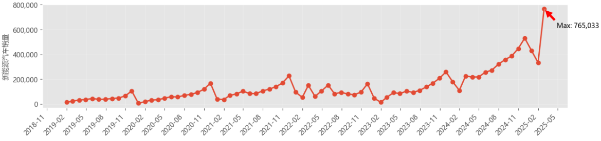
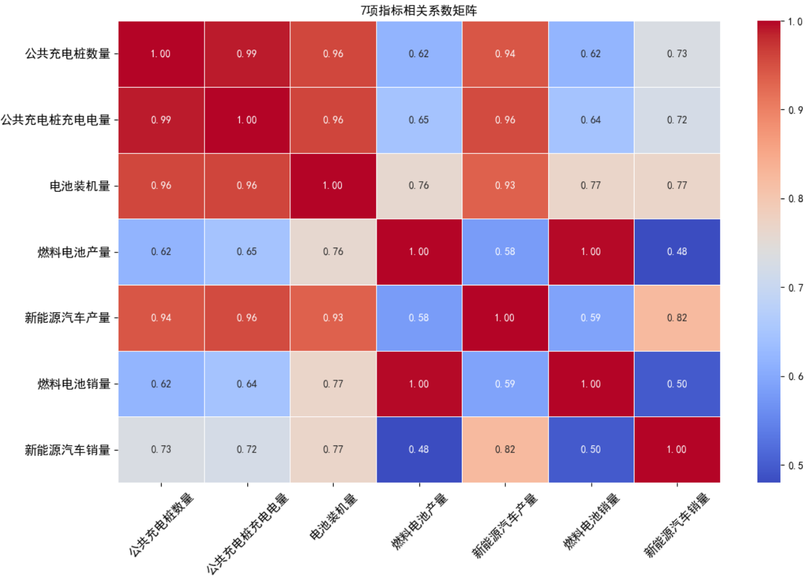

# 基于多模型融合的新能源汽车未来发展分析（广东省）

## 项目简介
本项目基于广东省新能源汽车及相关基础设施的时序数据，针对传统单模型分析精度低、权重分配主观、疫情干扰数据有效性等行业痛点，构建了一套完整的数据分析流程，涵盖**数据清洗、异常值检测、相关性分析、综合评价建模与灵敏度分析**，整合「层次分析法 (AHP)+ 熵值法 + 随机森林」多模型完成权重优化，并结合「全局线性拟合 (GLF)+ 全局二次拟合 (GQF)+ 有约束分段线性拟合 (CPLF)」实现精确预测新能源汽车销量趋势。本项目旨在量化新能源汽车的发展水平，识别关键驱动因素，并为政策制定与产业规划提供数据支撑。

## 研究背景
新能源汽车产业已成为全球汽车产业转型核心方向，2024 年全球新能源汽车销量突破 1600 万辆，中国市场占比超 60%，但现有研究存在三大核心问题：
- 评价指标维度单一，未结合「市场、技术、基建等」多维度构建体系；
- 权重分配依赖单一方法（纯主观 AHP 或纯客观熵值法），缺乏交叉验证；
- 疫情导致 2020-2022 年数据异常，传统全局拟合模型预测误差超 40%。

## 核心方法
### 1.指标选取：通过查找中国知网等学术文献，筛选与“创新”高度相关的关键词，最终确定 **7 个核心指标**：电池装机量、新能源汽车产量、公共充电桩充电电量、公共充电桩数量、燃料电池产量、燃料电池销量、新能源汽车销量。
- **数据分析**：在数据处理前，首先通过可视化完成全量数据的探索性分析，识别数据的趋势、周期、相关性特征，为后续的数据清洗与预处理提供依据，对应代码：[`预处理前的可视化_折线图.ipynb`](code/预处理前的可视化_折线图.ipynb)
- 通过折线图可视化7项原始指标的时间序列趋势，识别出核心特征：
- 所有指标均呈现长期线性增长趋势，符合新能源汽车产业的发展规律
- 数据存在明显的年度周期性波动（每年1-2月因春节假期出现规律性回落）
- 2020-2022年疫情期间，数据出现明显的异常波动，需针对性处理

- **相关性分析**：引入皮尔逊相关系数，进行7项原始指标的相关性分析，输出相关性热力图，识别指标间的多重共线性问题：
- 公共充电桩数量与充电电量相关系数达0.99，新能源汽车产量与销量相关系数达0.94，存在严重的多重共线性。
- 燃料电池产量与销量相关系数达1.00，产销高度同步。

*图2：7项原始指标相关性热力图（EDA核心输出）*

### 2.数据预处理：
  - **疫情分段处理**：将数据划分为疫情前（2019‑2020）、疫情中（2021‑2022）、疫情后（2023‑2025.2）三段，赋予不同权重，减少疫情对模型的干扰。
- **异常值检测**：
  - 线性回归残差分析法（标准化残差）。
  - 采用滑动四分位间距法（IQR）检验异常值。
- **缺失值填充**：采用趋势分解法（STL）分离趋势、季节与残差，利用趋势分量填补缺失值。
- **降维与去相关**：
  - 剔除新能源汽车产量（因为与销量强相关，为类似重复指标），保留新能源汽车销量指标。
  - 对燃料电池销量与电池装机量、公共充电桩数量与充电电量进行**主成分分析（PCA）**，生成“燃料电池装机综合指数”与“充电设施活跃度指数”。
  - 最终得到 **4 个关键指标**（相关系数 <= 0.7）：充电设施活跃度指数、燃料电池装机综合指数、燃料电池产量、新能源汽车销量。
- **归一化**：采用 Min‑Max 归一化至 [0,1] 区间。

### 3. 综合评价模型：
  - 层次分析法（主观权重）
  - 熵值法（客观权重）
  - 随机森林回归（特征重要性）
  - 线性加权融合
- **销量预测模型**：
  - 提出 **CPLF（约束分段线性拟合）** 模型
  - 以充电桩数量为分割变量，加入连续性约束
  - 对比 GLF / GQF，RMSE 降低至 500

## 主要结果
- 广东省新能源汽车发展指数从 0.51（2019）增长至 6.32（2025）
- CPLF 模型 R² ≈ 0.95，RMSE ≈ 500
- 市场需求（销量）为最核心驱动因素（权重 0.3895）

## 技术栈
Python / Pandas / NumPy / Scikit-learn / Matplotlib / Statsmodels

## 文件说明
- `notebooks/`：完整分析流程
- `src/`：可复用的模型代码
- `report/`：项目详细报告 PDF
